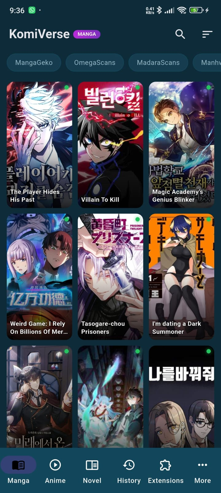
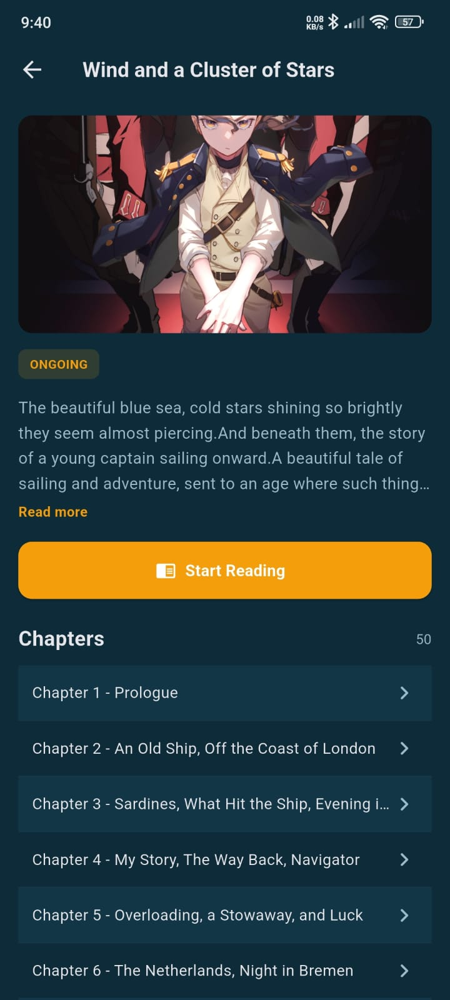
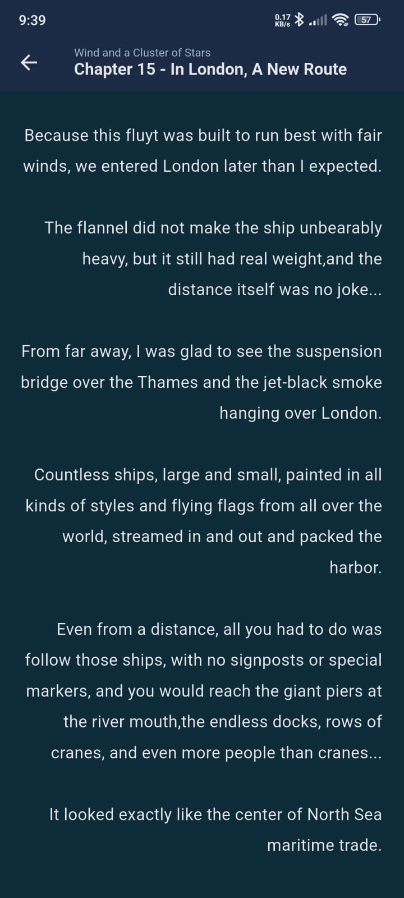
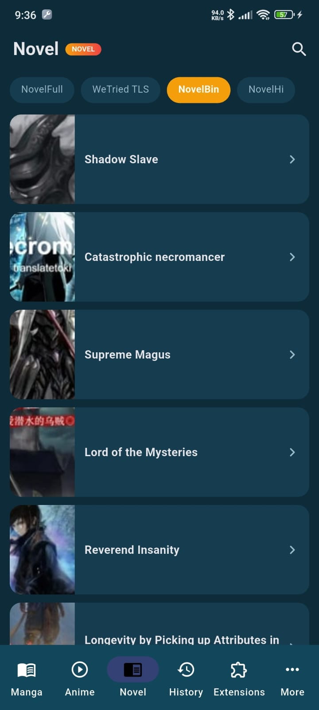
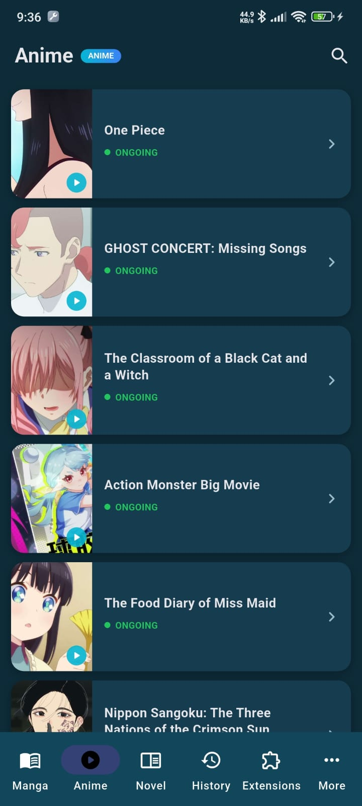
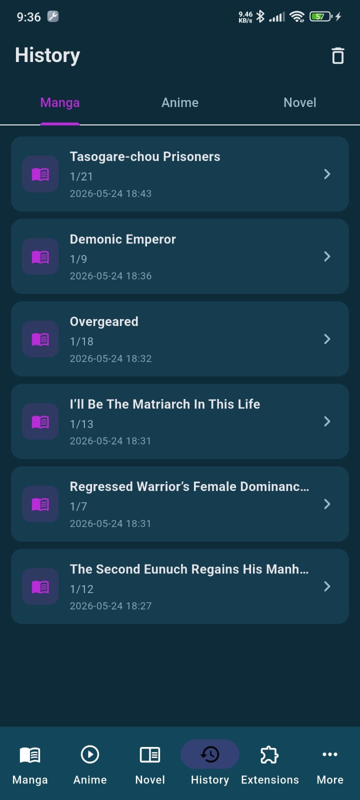
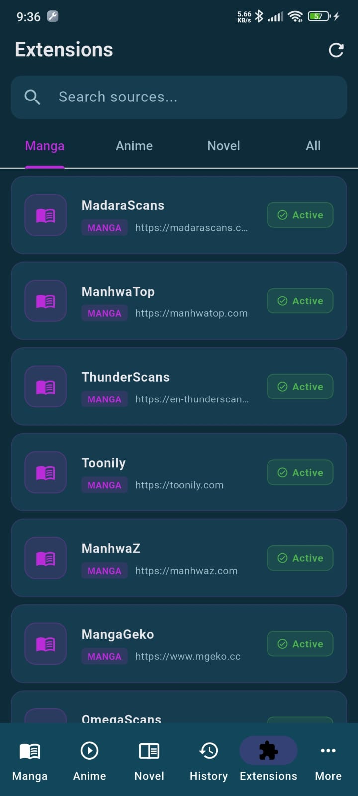
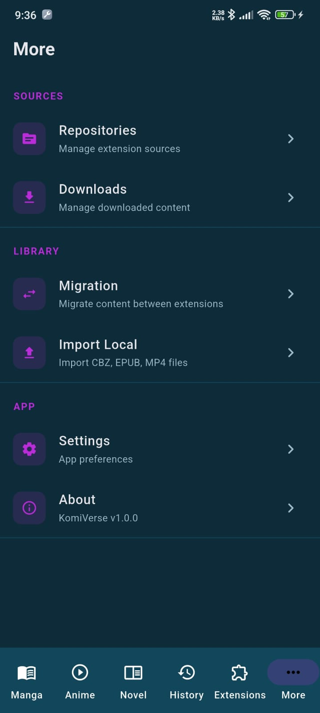

# KomiVerse

> A full-stack media reading platform for manga, anime, and novels — built with Flutter + Go.

KomiVerse is a self-hosted media consumption app combining a Flutter mobile client, a Go scraping API, and a local Consumet-compatible anime provider. Built as a portfolio project demonstrating end-to-end ownership: mobile UX, API design, scraper reliability patterns, and multi-service local orchestration.

**No public APK. No public API.** Intentionally self-hosted for legal and safety control — reviewers run everything locally from source.

---

## Screenshots

| Manga Browse | Manga Detail | Chapter Reader |
|:---:|:---:|:---:|
|  |  |  |

| Novel Browse | Anime Browse | History |
|:---:|:---:|:---:|
|  |  |  |

| Extensions | More |
|:---:|:---:|
|  |  |

---

## Architecture

```
Flutter App (frontend)
  └── Go API (Huang/backend-go)
        ├── Manga + Novel scrapers (GoQuery)
        └── Anime provider adapter
              └── Consumet-compatible API (Huang/api.consumet.org)
```

The Flutter app resolves the backend URL at runtime (from settings or reachable candidates), sends content requests to the Go API, which applies retry/throttle/circuit-breaker controls around scraping, and returns normalized payloads the client renders into list/detail/reader UI.

---

## Features

### Mobile (Flutter)
- Animated splash + onboarding flow
- Bottom navigation shell: **Manga · Anime · Novel · History · Extensions · More**
- **Manga** — browse popular/latest, title detail, chapter reader with vertical/horizontal modes, per-chapter progress persistence
- **Anime** — browse, detail, episode list, watch screen scaffold
- **Novel** — browse across multiple sources (NovelFull, WeTried TLS, NovelBin, NovelHi)
- **History** — timestamped read history across manga, anime, novel tabs
- **Extensions** — browse, install, uninstall sources; filter by type (Manga / Anime / Novel / All)
- **Settings** — runtime backend URL update, theme mode, reader direction, default source per media type

### Backend (Go)
- Unified API with pluggable source registry
- Manga sources: `toonily`, `manhwaz`, `madarascans`, `manhwatop`, `thunderscans`, `mangageko`, `omegascans`
- Novel sources: `novelbin`, `novelhi`, `novelfull`, `wetriedtls`
- Anime source: `animepahe` (via local Consumet adapter)
- In-memory TTL cache with stale fallback
- Retry + exponential backoff + jitter
- Per-domain token bucket throttling
- Circuit-breaker-style cooldown after repeated failures
- Global + per-IP rate limiting
- Optional async job execution with polling endpoint
- Prometheus-style metrics endpoint
- Built-in browser UI at `/anime` for quick testing

---

## Tech Stack

| Layer | Technology |
|---|---|
| Mobile | Flutter, Dart, Riverpod, go_router |
| HTTP Client | Dio |
| Backend | Go 1.24+, Gin, GoQuery |
| Provider Service | Node.js, TypeScript, Fastify (Consumet-compatible) |
| Mobile Persistence | SharedPreferences |
| Backend Cache/Jobs | In-memory TTL (single-node) |
| Infra | Docker Compose |

---

## Repository Layout

```
komiverse/
  frontend/                    # Flutter mobile app
  Huang/backend-go/            # Go API (scrapers, caching, jobs, metrics)
  Huang/api.consumet.org/      # Consumet-compatible provider service (TypeScript)
  docs/
    ARCHITECTURE.md
    INTERNSHIP_SHOWCASE.md
    GITHUB_PUBLISH_CHECKLIST.md
  README.md
  IMPLEMENTATION_SUMMARY.md
```

---

## Running Locally

Three services, three terminals.

### Prerequisites
- Flutter SDK
- Go 1.24+
- Node.js + npm
- (Android) ADB for physical device

### 1 — Anime provider service (port 3000)

```powershell
cd Huang\api.consumet.org
npm install
npm run dev
```

### 2 — Go backend (port 8081)

```powershell
cd Huang\backend-go
$env:PORT="8081"
$env:CONSUMET_BASE_URL="http://localhost:3000/anime"
go run ./cmd/server
```

Verify: `curl http://localhost:8081/api/health`

### 3 — Flutter app

```powershell
cd frontend
flutter pub get
flutter run --dart-define=BACKEND_BASE_URL=http://127.0.0.1:8081
```

**Android physical device via USB:**

```powershell
adb reverse tcp:8081 tcp:8081
flutter run --dart-define=BACKEND_BASE_URL=http://127.0.0.1:8081
```

---

## Backend API Reference

Base path: `/api`

| Method | Endpoint | Description |
|---|---|---|
| GET | `/api/health` | Service health |
| GET | `/api/health/sites` | Scraper domain health snapshot |
| GET | `/api/sources` | List all registered sources |
| GET | `/api/browse` | Browse popular/latest — `?source=&sort=popular\|latest&page=` |
| GET | `/api/search` | Search titles — `?source=&q=&page=` |
| GET | `/api/info/{source}/{id}` | Title metadata |
| GET | `/api/chapters/{source}/{id}` | Chapter/episode list |
| GET | `/api/pages/{source}/{chapterId}` | Chapter pages or novel content |
| GET | `/api/jobs/{jobId}` | Poll async job |
| GET | `/metrics` | Prometheus metrics (when enabled) |

Append `?async=true` to browse/search/info/chapters/pages for a `202 Accepted` + `job_id` response.

---

## Key Environment Variables

| Variable | Default | Description |
|---|---|---|
| `PORT` | `8080` | API server port |
| `CONSUMET_BASE_URL` | — | Anime provider base URL |
| `CACHE_ENABLED` | `true` | Toggle in-memory cache |
| `CACHE_TTL` | — | Cache entry lifetime |
| `ASYNC_ENABLED` | — | Toggle async job queue |
| `SCRAPE_RETRY_COUNT` | — | Scraper retry attempts |
| `SCRAPE_DOMAIN_RPS` | — | Per-domain request rate |
| `METRICS_ENABLED` | `true` | Prometheus metrics endpoint |
| `ENABLE_DEBUG_ROUTES` | `false` | Expose debug endpoints |

See `.env.example` in `Huang/backend-go/` for the full list.

---

## Docker

```bash
# Dev profile (direct API port)
docker compose --profile dev up --build

# Edge profile (HTTP reverse proxy)
docker compose --profile edge up -d

# TLS edge profile
docker compose --profile edge-tls up -d
```

See `README.production.md` for full TLS bootstrap and production rebuild instructions.

---

## Project Status

| Area | Status |
|---|---|
| Manga browse → detail → reader | ✅ Complete |
| Reading progress persistence | ✅ Complete |
| Novel browse + reader | ✅ Complete |
| Anime browse + detail + episode list | ✅ Complete |
| Anime streaming playback | 🚧 Scaffold only |
| History (manga) | ✅ Complete |
| History sync (anime/novel) | 🚧 Placeholder |
| Extensions UI | ✅ Complete |
| Backend scraper reliability | ✅ Complete |
| Automated tests | ❌ Minimal |
| CI pipeline | ❌ Not yet |

---

## Roadmap

- Complete anime streaming playback integration
- Real history sync across manga/anime/novel
- Automated tests across mobile + backend flows
- CI pipeline (lint, analyze, build, smoke tests)

---

## Why No Live APK / Public API

This project scrapes third-party sites. Publishing a public API endpoint or APK would create legal and operational risk. Reviewers can run the full stack locally from source in under five minutes.

---

## Documentation

- [Architecture](/docs/ARCHITECTURE.md)
- [Implementation Summary](/IMPLEMENTATION_SUMMARY.md)
- [Internship Showcase Notes](/docs/INTERNSHIP_SHOWCASE.md)
- [GitHub Publishing Checklist](/docs/GITHUB_PUBLISH_CHECKLIST.md)

---

## License

MIT License — see [LICENSE](./LICENSE) for details.
